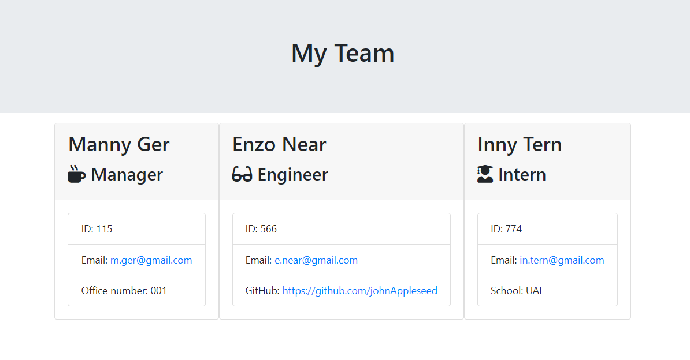
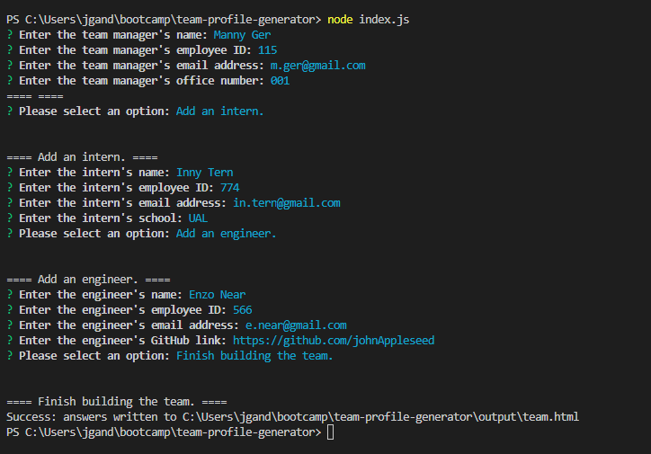
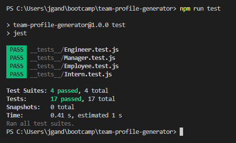

# Team Profile Generator

## Description
This project allowed me to hone my skills with npm, inquirer and node.js - and developed familiarity with test-driven development by writing code that had to pass the tests provided. By collecting user responses with inquirer, I then processed the data and accordingly wrote it to a HTML file to display the members of a team.

    

## Table of Contents
- [Installation](#installation)
- [Usage](#usage)
- [Credits](#credits)
- [Tests](#tests)
- [Questions](#questions)

## Installation
User must have [`node.js`](https://nodejs.org/en/download/current) installed.
## Usage
Run `node index.js` in the terminal in the working directory. Follow the prompts and then navigate and open the generated HTML file in the output directory.

	
	
	
## Contributors & Credits
### Contributors
N/A
### Credits
- [Node.js](https://nodejs.org/en/download/current)
- [NPM Inquirer](https://www.npmjs.com/package/inquirer?activeTab=readme)
- [NPM Path](https://www.npmjs.com/package/path)

## Tests
All accompanying tests passed.

## Questions
Please contact me if you have any questions:

 
		